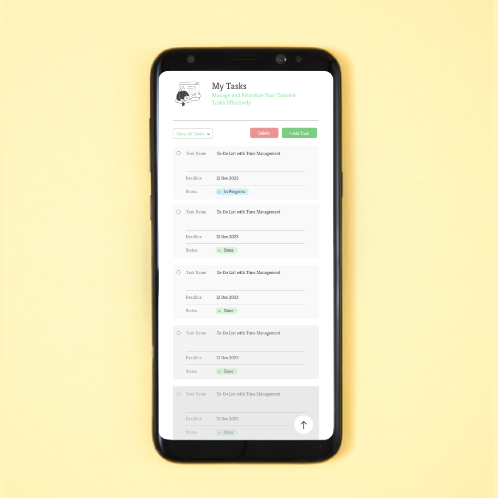
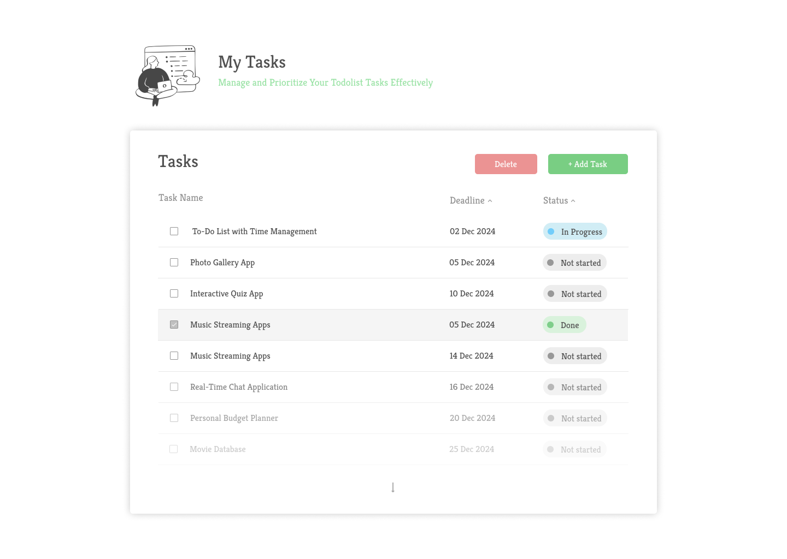

## Demo App

### Devices Mobile

### Devices Dekstop

### Build with Stack

- ReactJs + Typescripts
- TailwindCss

### Feature

- Adding Tasks
  - [x] Users can add new tasks by entering text and due date.
  - [x] Each new task is added to the list of unfinished tasks.
- Editing Tasks
  - [ ] Users can edit an existing task by clicking on it.
  - [ ] An editing form appears, allowing users to update the task text and due date.
- Delete Tasks
  - [x] Users can delete existing tasks by pressing the “Delete” button next to the task.
- Marking Tasks as Completed
  - [ ] Users can mark tasks as complete by checking the box next to the task.
- Filtering Tasks
  - [ ] Users can filter the task list to only show incomplete or completed tasks.
  - [ ] Users can also choose to view all tasks without filters.
- Responsive
  - [x] Mobile devices
  - [ ] Laptop devices
  - [ ] Desktop Devices

### What i get

....
