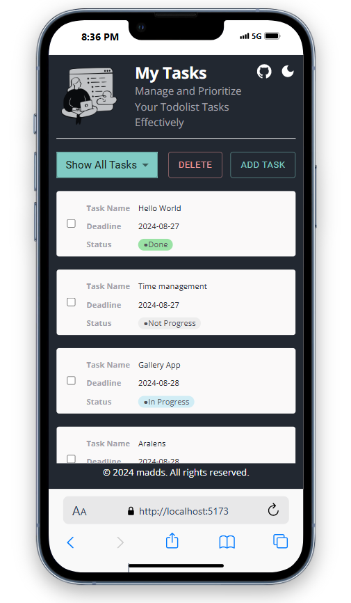
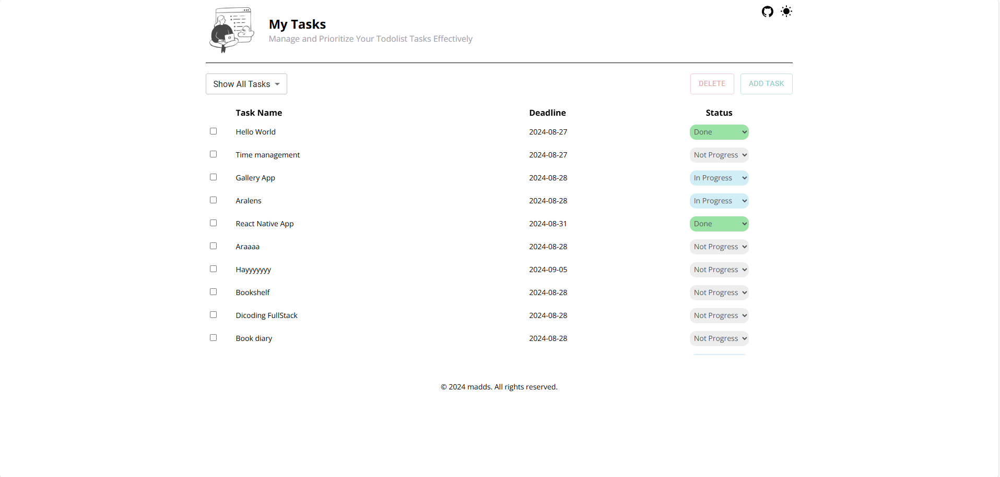
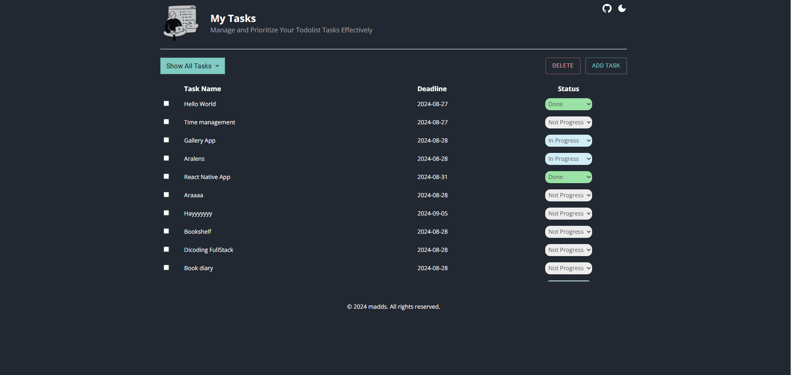

## Demo App

### Devices Mobile

### Devices Dekstop light

### Devices Dekstop Darkmode

### Build with Stack

- ReactJs + Typescripts
- Material UI
- Zustand
- TailwindCss

### Feature

- Adding Tasks
  - [x] Users can add new tasks by entering text and due date.
  - [x] Each new task is added to the list of unfinished tasks.
- Editing Tasks
  - [ ] Users can edit an existing task by clicking on it.
  - [ ] An editing form appears, allowing users to update the task text and due date.
- Delete Tasks
  - [x] Users can delete existing tasks by pressing the “Delete” button next to the task.
- Marking Tasks as Completed
  - [x] Users can mark tasks as complete by checking the box next to the task.
- Filtering Tasks
  - [x] Users can filter the task list to only show incomplete or completed tasks.
  - [x] Users can also choose to view all tasks without filters.
- Responsive
  - [x] Mobile devices
  - [x] Laptop devices
  - [x] Desktop Devices

### What i get

My first project used React JS and Typscript plus state management using the library from Zustand. I worked on it for about 2 days. I gained very important knowledge about the front using a stack like this.
